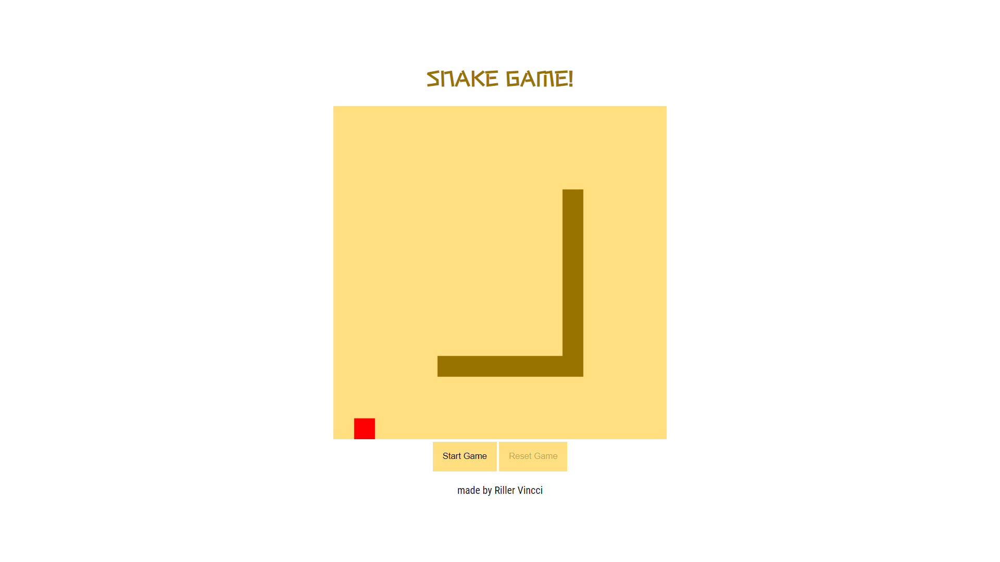

# Snake Game
#### Project provided by the Digital Innovation course

The epic Snake Game is the proposal for one of the courses presented in the **HTML Web Developer** bootcamp. Concepts about **CSS, Javascript and Canvas** are covered in the course and emphasize the development of games with Javascript.

You can go to my github [page](https://rvsriller.github.io/rierSnakeGame/) and see how the first version of this game looks like :video_game: :video_game:

# Tecnologies

- HTML5 
- CSS3
- Javascript ES6

